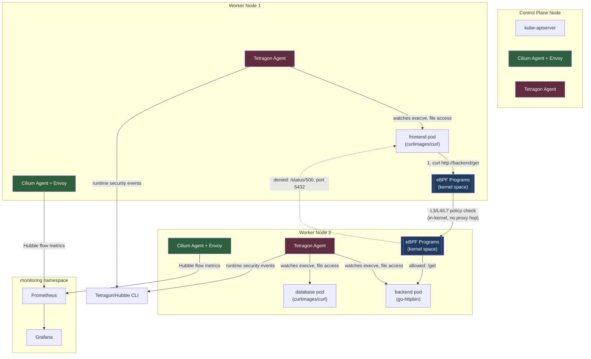
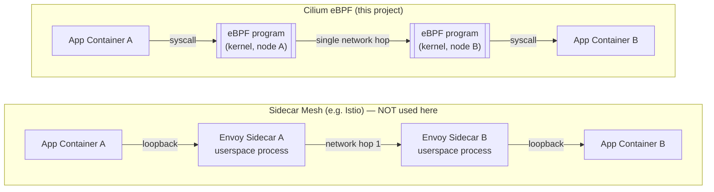

# eBPF-Based Zero-Overhead Observability & Runtime Security

**Stack:** Cilium (eBPF CNI) + Hubble + Tetragon + Kubernetes + Prometheus + Grafana
**No sidecars. No traditional userspace agents.** Network policy enforcement,
network observability, and runtime security monitoring all happen at the
Linux kernel level via eBPF.

Repo: `https://github.com/sonujha78/ebpf-cilium-tetragon`

---

## Table of Contents

1. [Why eBPF](#why-ebpf)
2. [Architecture](#architecture)
3. [Prerequisites](#prerequisites)
4. [Step-by-Step Setup](#step-by-step-setup)
   - [Phase 1 — Project & Git Setup](#phase-1--project--git-setup)
   - [Phase 2 — Multi-Node kind Cluster](#phase-2--multi-node-kind-cluster)
   - [Phase 3 — Install Cilium](#phase-3--install-cilium)
   - [Phase 4 — Enable Hubble](#phase-4--enable-hubble)
   - [Phase 5 — Deploy Sample Microservices](#phase-5--deploy-sample-microservices)
   - [Phase 6 — Network Policies (L3/L4/L7)](#phase-6--network-policies-l3l4l7)
   - [Phase 7 — Metrics, Prometheus & Grafana](#phase-7--metrics-prometheus--grafana)
   - [Phase 8 — Tetragon Runtime Security](#phase-8--tetragon-runtime-security)
   - [Phase 9 — Attack Simulation](#phase-9--attack-simulation)
   - [Phase 10 — Performance Comparison](#phase-10--performance-comparison)
5. [Results Summary](#results-summary)
6. [Troubleshooting Log](#troubleshooting-log)
7. [Repository Structure](#repository-structure)

---

## Why eBPF

Traditional service meshes (e.g. Istio) intercept traffic using a sidecar
proxy injected into every pod. Every request pays for an extra network hop
and CPU cycles spent in a userspace proxy process — twice, once on the
caller's side and once on the callee's side.

eBPF programs run directly inside the Linux kernel. They can inspect and
act on packets and syscalls without any proxy sitting in the data path.
Cilium replaces the entire pod-networking layer (the CNI) with an
eBPF-based implementation, and can even replace `kube-proxy` itself
(`kube-proxy-replacement` mode). Tetragon goes one layer deeper: it hooks
directly into kernel syscalls (`execve`, file access, etc.) for real-time
runtime security, independent of anything the application does.

This project deploys both, end-to-end, on a real multi-node Kubernetes
cluster, and proves — with live captured evidence, not just claims — that
enforcement and observability both happen before traffic or a malicious
action ever reaches application code.

---

## Architecture



### Where does a sidecar sit vs. where does eBPF attach?



**Sidecar path:** app → loopback → userspace proxy → network → userspace
proxy → loopback → app. Two extra userspace processes, two extra hops.

**eBPF path:** app → kernel eBPF program → network → kernel eBPF program →
app. No extra process, no extra hop. L7 inspection (when required) uses a
single Envoy instance **per node**, not per pod, so it doesn't scale with
the number of services the way per-pod sidecars do.

---

## Prerequisites

- Ubuntu machine with Docker installed
- Internet access for pulling images and Helm charts

Tool versions used in this build:

| Tool        | Version   |
|-------------|-----------|
| Docker      | 29.1.3    |
| kubectl     | v1.37.0   |
| kind        | v0.23.0   |
| Helm        | v3.21.4   |
| Cilium CLI  | v0.20.0   |
| Hubble CLI  | v1.16.3 (pinned — see [Troubleshooting](#troubleshooting-log)) |
| Cilium      | v1.16.3   |
| Tetragon    | latest (via `cilium/tetragon` Helm chart) |

Install everything:

```bash
# kubectl
curl -LO "https://dl.k8s.io/release/$(curl -L -s https://dl.k8s.io/release/stable.txt)/bin/linux/amd64/kubectl"
sudo install -o root -g root -m 0755 kubectl /usr/local/bin/kubectl
rm kubectl

# kind
curl -Lo ./kind https://kind.sigs.k8s.io/dl/v0.23.0/kind-linux-amd64
chmod +x ./kind
sudo mv ./kind /usr/local/bin/kind

# helm
curl https://raw.githubusercontent.com/helm/helm/main/scripts/get-helm-3 | bash

# cilium CLI
CILIUM_CLI_VERSION=$(curl -s https://raw.githubusercontent.com/cilium/cilium-cli/main/stable.txt)
curl -L --fail --remote-name-all https://github.com/cilium/cilium-cli/releases/download/${CILIUM_CLI_VERSION}/cilium-linux-amd64.tar.gz
sudo tar xzvfC cilium-linux-amd64.tar.gz /usr/local/bin
rm cilium-linux-amd64.tar.gz

# hubble CLI — pinned to v1.16.3 to match the installed Cilium/Hubble Relay version
curl -L --fail --remote-name-all https://github.com/cilium/hubble/releases/download/v1.16.3/hubble-linux-amd64.tar.gz
sudo tar xzvfC hubble-linux-amd64.tar.gz /usr/local/bin
rm hubble-linux-amd64.tar.gz
```

---

## Step-by-Step Setup

### Phase 1 — Project & Git Setup

```bash
mkdir -p ~/ebpf-cilium-tetragon
cd ~/ebpf-cilium-tetragon

mkdir -p benchmarks docs/diagrams docs/screenshots grafana kind-config \
         manifests/microservices manifests/network-policies manifests/tetragon-policies scripts

git init
cat > .gitignore << 'EOF'
*.log
*.tmp
.DS_Store
kubeconfig*
EOF

git add .
git commit -m "chore: initial project structure"
git remote add origin https://github.com/sonujha78/ebpf-cilium-tetragon.git
git branch -M main
git push -u origin main
```

### Phase 2 — Multi-Node kind Cluster

`kind-config/cluster.yaml`:

```yaml
kind: Cluster
apiVersion: kind.x-k8s.io/v1alpha4
name: ebpf-cluster
networking:
  disableDefaultCNI: true
  kubeProxyMode: "none"
nodes:
  - role: control-plane
  - role: worker
  - role: worker
```

```bash
kind create cluster --config kind-config/cluster.yaml
kubectl get nodes -o wide
```

At this point nodes will show `NotReady` — this is expected, since no CNI
is installed yet.

### Phase 3 — Install Cilium

```bash
cilium install --version 1.16.3 \
  --set kubeProxyReplacement=true \
  --set k8sServiceHost=ebpf-cluster-control-plane \
  --set k8sServicePort=6443

cilium status --wait
kubectl get nodes    # all should now show Ready
```

### Phase 4 — Enable Hubble

```bash
cilium hubble enable --ui
cilium status --wait   # Hubble Relay: OK, Hubble UI pods Running

# View live flows in a browser
cilium hubble ui       # opens http://localhost:12000
```

### Phase 5 — Deploy Sample Microservices

Three services in a `demo` namespace: `frontend` (test client), `backend`
(a real HTTP API — `go-httpbin`), and `database` (placeholder, port 5432).

```bash
kubectl apply -f manifests/microservices/apps.yaml
kubectl get pods -n demo -o wide

# sanity check — should return JSON
kubectl exec -n demo deploy/frontend -- curl -s http://backend/get
```

### Phase 6 — Network Policies (L3/L4/L7)

Four `CiliumNetworkPolicy` resources, applied in this order:

1. `01-default-deny.yaml` — default-deny all ingress in `demo`
2. `03-allow-backend-to-database.yaml` — backend → database on port 5432
3. `04-l7-http-allow-get-block-status.yaml` — frontend → backend, **only**
   `GET /get` and `GET /headers` allowed at the **HTTP layer**; any other
   path (e.g. `/status/500`, standing in for an admin path) is denied by
   Cilium's embedded Envoy before it reaches the backend container.

```bash
kubectl apply -f manifests/network-policies/
kubectl get cnp -n demo

# allowed
kubectl exec -n demo deploy/frontend -- curl -s -o /dev/null -w "%{http_code}\n" http://backend/get
# => 200

# blocked at L3/L4 (no policy allows frontend -> database)
kubectl exec -n demo deploy/frontend -- curl -s -m 3 http://database:5432
# => times out (curl exit code 28) — request never reaches the pod

# blocked at L7 (path not in the allow-list)
kubectl exec -n demo deploy/frontend -- curl -s -o /dev/null -w "%{http_code}\n" http://backend/status/500
# => 403, returned by Envoy — the backend application never saw the request
```

Live proof via Hubble:

```bash
hubble observe --namespace demo --protocol http --last 10
```

```
GET /get         -> http-request FORWARDED -> response 200
GET /status/500   -> http-request DROPPED   -> response 403
```

### Phase 7 — Metrics, Prometheus & Grafana

Enable Hubble's Prometheus metrics with per-pod source/destination
context (needed for a "requests per service pair" dashboard):

```yaml
# grafana/hubble-metrics-values.yaml
hubble:
  metrics:
    enabled:
      - "dns:query;ignoreAAAA"
      - "drop"
      - "tcp"
      - "flow:sourceContext=workload-name|reserved-identity;destinationContext=workload-name|reserved-identity"
      - "port-distribution"
      - "icmp"
      - "http"
    enableOpenMetrics: true
```

```bash
helm repo add cilium https://helm.cilium.io/
helm upgrade cilium cilium/cilium --version 1.16.3 \
  --namespace kube-system --reuse-values \
  -f grafana/hubble-metrics-values.yaml
kubectl -n kube-system rollout restart daemonset cilium
```

Install Prometheus + Grafana:

```bash
helm repo add prometheus-community https://prometheus-community.github.io/helm-charts
helm install monitoring prometheus-community/kube-prometheus-stack \
  --namespace monitoring --create-namespace \
  --set grafana.adminPassword=admin123 \
  --set prometheus.prometheusSpec.serviceMonitorSelectorNilUsesHelmValues=false \
  --set prometheus.prometheusSpec.podMonitorSelectorNilUsesHelmValues=false
```

Expose Hubble metrics to Prometheus (`grafana/hubble-metrics-service.yaml`
+ `grafana/hubble-servicemonitor.yaml`), then verify targets at
`localhost:9090/targets` → `serviceMonitor/monitoring/hubble-metrics` should
show `3/3 up`.

Grafana dashboard panels (PromQL):

| Panel                          | Query |
|--------------------------------|-------|
| Requests per Service Pair      | `sum(rate(hubble_flows_processed_total{verdict="FORWARDED"}[2m])) by (source, destination)` |
| Dropped/Denied connections     | `sum(rate(hubble_drop_total[1m])) by (reason)` |
| DNS Query Visibility           | `sum(rate(hubble_dns_queries_total[1m])) by (query)` |

> **DNS caveat:** DNS metrics only populate once Cilium's DNS proxy is
> actually in the path for a pod. Add a visibility annotation to trigger
> proxying:
> ```bash
> kubectl patch deployment frontend -n demo --type='json' -p='[{"op":"add","path":"/spec/template/metadata/annotations","value":{"io.cilium.proxy-visibility":"<Egress/53/UDP/DNS>"}}]'
> ```

### Phase 8 — Tetragon Runtime Security

```bash
helm install tetragon cilium/tetragon --namespace kube-system
kubectl -n kube-system rollout status daemonset tetragon
```

**TracingPolicy #1 — detect shell spawn** (`01-detect-shell-spawn.yaml`):
kprobe on `sys_execve`, matching `/bash` / `/sh`, action `Post` (alert,
non-blocking). Any container that shouldn't run a shell (e.g. a minimal
API container) gets flagged the instant a shell process is spawned inside
it — visible instantly via `tetra getevents`, with full process lineage.

**TracingPolicy #2 — block sensitive file access**
(`02-block-sensitive-file-access.yaml`): kprobe on
`security_file_permission`, matching `/etc/shadow`, action `Sigkill`.
Any process attempting to read `/etc/shadow` is killed by the kernel
before it can read a single byte — even a `root` user inside the
container cannot bypass this, since the block is enforced above the
normal Linux DAC permission check.

```bash
kubectl apply -f manifests/tetragon-policies/
kubectl get tracingpolicy
```

### Phase 9 — Attack Simulation

`scripts/attack-simulation.sh` runs three attacks back-to-back against
the `demo` namespace and captures Tetragon + Hubble evidence for each:

```bash
bash scripts/attack-simulation.sh | tee docs/screenshots/phase9-attack-simulation-output.txt
```

See [Results Summary](#results-summary) below for the captured output.

### Phase 10 — Performance Comparison

Measured Cilium eBPF latency for `frontend → backend` (50 requests, all
network policies active):

```bash
kubectl exec -n demo deploy/frontend -- sh -c '
for i in $(seq 1 50); do
  curl -s -o /dev/null -w "%{time_total}\n" http://backend/get
done'
```

| Metric  | Cilium eBPF (measured) |
|---------|-------------------------|
| Min     | 2.03 ms |
| Max     | 7.97 ms |
| Average | 3.40 ms |

Full comparison against sidecar-mesh (Istio) overhead — including why a
sidecar mesh doubles the proxy hop count per request and Cilium doesn't —
is documented in `docs/notes-phase10-performance-comparison.md`.

---

## Results Summary

| Requirement | Evidence |
|---|---|
| Multi-node cluster, Cilium as CNI, kube-proxy replaced | `kubectl get nodes` → all `Ready`; `cilium status` → OK |
| L3/L4 default-deny + explicit allow | `frontend → database` times out (exit 28); `frontend → backend` succeeds |
| L7 path-based policy | `/get` → 200; `/status/500` → 403 (Envoy, before reaching app) |
| Enforcement proven at network layer | Hubble: `GET /status/500` shown as `http-request DROPPED` |
| Live Hubble observability | `hubble observe` streams every flow, allowed and denied, no app logging |
| Investigation exercise | `frontend → database:5432` flagged in Hubble as `Policy denied / DROPPED` purely from flow data |
| Metrics → Prometheus → Grafana | 3 dashboard panels: requests/service-pair, drops-over-time, DNS |
| Tetragon shell-spawn detection | `tetra getevents` captured `/bin/sh -c "echo hello..."` inside `database` pod with full process lineage |
| Tetragon file-access block | `cat /etc/shadow` → `Killed`, `EXIT_CODE:137` (SIGKILL), even as root |
| Attack simulation | `scripts/attack-simulation.sh` — shell spawn detected, `/etc/shadow` blocked, network call denied, zero app changes |
| Performance rationale | eBPF: 3.40ms avg, single in-kernel hop; sidecar: 2 extra userspace proxy hops per request (documented) |

---

## Troubleshooting Log

Real issues hit during this build, and how they were resolved — kept here
because they're the non-obvious part of this task.

| Problem | Root Cause | Fix |
|---|---|---|
| `ErrImagePull` / `ImagePullBackOff` on `nicolaka/netshoot` and `kennethreitz/httpbin` | `TLS handshake timeout` pulling large images from Docker Hub inside kind nodes | Switched to smaller, actively maintained images: `curlimages/curl`, `mccutchen/go-httpbin` |
| L7 policy (`/get` allowed, `/status/500` blocked) had no effect — both paths returned 200/500 normally | An older L4-only policy (`allow-frontend-to-backend`, no HTTP rules) was still present; Cilium **unions** all matching ingress rules, so the L4-only rule silently allowed every path | Deleted the L4-only policy so only the L7 policy governs `frontend → backend` |
| `hubble observe` failing with `invalid fieldmask` | Hubble CLI version (v1.19.4) newer than the installed Hubble Relay (v1.16.3) — protocol mismatch | Reinstalled Hubble CLI pinned to v1.16.3 to match |
| Hubble DNS metrics (`hubble_dns_*`) always showed "No data" even with `dns` metric enabled | Cilium only inspects DNS at L7 (and thus emits DNS metrics) when traffic is routed through its DNS proxy; a plain pod doesn't trigger this without a visibility hint | Added `io.cilium.proxy-visibility: "<Egress/53/UDP/DNS>"` annotation to the `frontend` deployment |
| `git push` rejected with `(fetch first)` / `non-fast-forward` | Remote `LICENSE` file was created on GitHub after local repo was initialized, causing diverging histories | `git pull origin main --allow-unrelated-histories --no-rebase`, resolved merge, then pushed |
| Merge stuck showing `:wq` typed literally into the commit message file | `:wq` was typed while `git commit`'s default editor (vim) was still in insert mode | `git config --global core.editor "nano"` to avoid vim entirely; `git commit --no-edit` to accept the auto-generated merge message |
| `cat /etc/shadow` returned `Permission denied` (exit code 1) instead of being blocked by Tetragon | Standard Linux DAC file permissions blocked the non-root `curl_user` before Tetragon's kprobe could even fire — this wasn't a real test of the policy | Patched the `database` deployment with `securityContext.runAsUser: 0` (root) to prove Tetragon's kernel-level block works independently of, and above, normal file permissions |
| `kubectl top pods` → `error: Metrics API not available` | `metrics-server` is not installed by default on kind clusters | Used Hubble/Cilium's own Prometheus metrics instead of `kubectl top` for observability data |
| Several `kube-controller-manager` / `kube-etcd` / `kube-scheduler` Prometheus targets show `DOWN` | These control-plane components don't expose metrics externally by default on kind clusters | Not fixed — expected and irrelevant to Cilium/Hubble/Tetragon metrics, which all show `UP` |

---

## Repository Structure

```
.
├── README.md                          # this file
├── LICENSE
├── kind-config/
│   └── cluster.yaml                   # 3-node kind cluster, kube-proxy disabled
├── manifests/
│   ├── microservices/apps.yaml        # frontend, backend, database
│   ├── network-policies/              # CiliumNetworkPolicy (L3/L4 + L7)
│   └── tetragon-policies/             # TracingPolicy (shell-spawn, file-access)
├── grafana/
│   ├── hubble-metrics-values.yaml     # Helm values enabling Hubble Prometheus metrics
│   ├── hubble-metrics-service.yaml    # headless Service exposing :9965/metrics
│   └── hubble-servicemonitor.yaml     # Prometheus ServiceMonitor
├── scripts/
│   └── attack-simulation.sh           # end-to-end attack simulation
├── benchmarks/                        # latency test raw output
└── docs/
    ├── notes-phaseN-*.md              # detailed notes per phase
    └── screenshots/                   # Hubble/Tetragon/Grafana evidence
```
